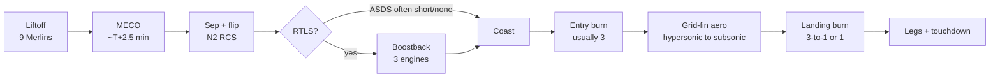
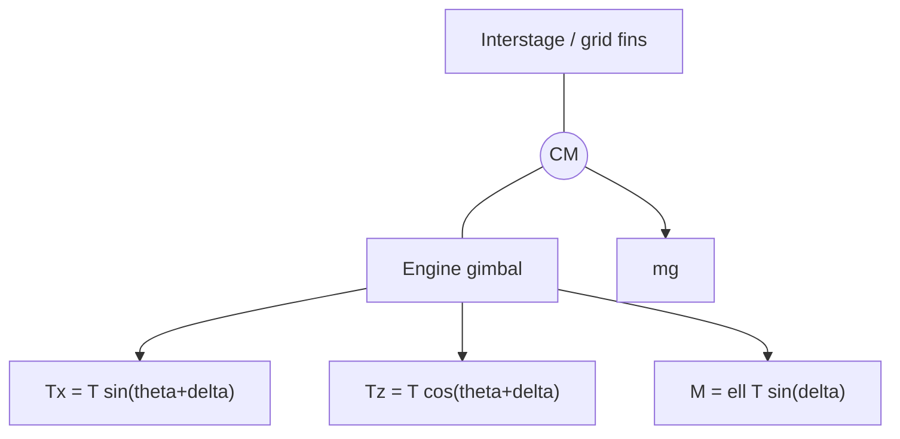
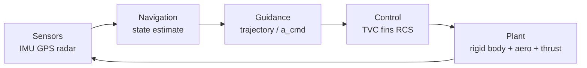

# Landing a Falcon 9 First Stage

A technical tutorial for a structural engineer who is also building a 2D inverted-pendulum landing simulator.

Tommy — this is written for you. You already think in free-body diagrams, second-order dynamics, and “what does this load path actually do.” The Falcon 9 first-stage landing is the same kind of problem, just with a throttle you cannot turn off, a vehicle that is aerodynamically a falling chimney, and a commit altitude measured in seconds. The 2D sim you are building is not a toy version of the wrong problem. It is the right problem with most of the clothing stripped off.

Public numbers below are tagged. **Official** means SpaceX’s current Falcon User’s Guide (Rev. 8, March 2025) or the Falcon 9 vehicle page. **Unofficial** means widely cited compilations (Wikipedia, Spaceflight101, reconstructed timelines) or a public comment that is not in the current guide. Approximate values are labeled as such. I will not invent a paper, a quote, or a thrust number.

---

## 1. Why this is hard

An airplane landing is a controlled conversion of kinetic energy into lift, drag, and finally rolling friction. The vehicle is already the right way up. The wing still works at the flare. The pilot (or the autoland) can go around. The runway is measured in kilometers.

A Falcon 9 first stage arriving at a pad or a droneship is doing something else. After main-engine cutoff it is a slender, almost-empty tube, forty-odd meters long and 3.66 m in diameter, falling engines-first toward a concrete disk or a barge deck. It has no wings. The four grid fins are control surfaces, not a lifting body. The nine Merlin engines were sized for liftoff of a 549-tonne stack, not for hovering 25-odd tonnes of dry booster. The landing burn is a late commit: light too late and you hit; light too early and the engine, which cannot throttle to weight, lofts you back into the air. There is no go-around in the aircraft sense. The “runway” is tens of meters across, and if the target is an Autonomous Spaceport Drone Ship it is also moving.

Call the vehicle what it is mechanically: an inverted pendulum with the hinge at the engine gimbal and the mass above it. A broomstick on your palm is the same plant. Open-loop upright thrust does not stabilize it. You must continuously put the thrust vector under the center of mass, or the horizontal acceleration from any lean integrates twice into a miss, and then into a tip-over.

Several disturbances make the plant less polite than a classroom broomstick:

- **Engine-out and engine-restart.** The landing is not one burn. Typical recoveries restart a subset of Merlins two or three times (boostback on many profiles, entry, landing). Each restart is a TEA-TEB ignition of a gas-generator engine that has been coasting, chilling, and seeing vacuum then atmosphere. SpaceX demonstrated first-stage engine-out on *ascent* as early as CRS-1 (2012); the landing problem is the complementary one — getting an engine *back on* when you need it.
- **Wind and aero.** From roughly 70 km down, the stage is a bluff body in a rapidly changing Mach field. The center of pressure is not at the center of mass. Grid fins have authority that vanishes as dynamic pressure falls in the last seconds, which is exactly when you most want to be vertical over a small target.
- **Late commit.** The landing burn is on the order of tens of seconds, not minutes. Guidance is solving a two-point boundary value problem with a control that is bounded away from zero.
- **Tiny landing zone.** A pad at LZ-1 / LZ-2 / LZ-4 is a painted circle. A droneship deck is a barge. Either is small compared to the position uncertainty you would tolerate if you could hover and walk it in.

The rest of this note is how the vehicle, the burns, and the GNC turn that unstable plant into a routine recovery. As of mid-August 2026 the public tally is on the order of 600 successful Falcon first-stage landings; the engineering did not get easier, it got repeatable.

---

## 2. The mission timeline

What each burn is *buying* matters more than the clock. Times and altitudes below are typical Eastern-range profiles, reconstructed from public mission timelines (Spaceflight Now and similar). They vary with payload, target orbit, and whether the booster is coming home or meeting a ship. Treat the numbers as order-of-magnitude, not a flight rules card.

**MECO and staging.** Nine sea-level Merlins shut down. The User’s Guide lists commanded shutdown and a pneumatic stage-separation system: mechanical latches released by high-pressure helium, then pneumatic pushers (including a redundant center pusher) to enforce a positive, low-shock separation. A few seconds later the second-stage Merlin Vacuum lights. The first stage is now on its own, typically somewhere in the neighborhood of 60–80 km and a few kilometers per second downrange, well above most of the atmosphere, engines forward of the velocity vector in the wrong sense for landing.

**Flip.** Nitrogen cold-gas thrusters (the User’s Guide lists GN2 ACS for coast / recovery attitude control) pitch the stage engines-first. This is not optional cosmetics. Every subsequent burn is a braking burn; the thrust must point near the velocity vector. The flip is a rigid-body slew plus residual rates. Grid fins typically deploy around this phase so they are ready when air shows up.

**Boostback (RTLS, and some ASDS).** Three Merlins relight and burn on the order of a minute (RTLS) to cancel, then reverse, the downrange velocity so the instantaneous impact point walks back to the landing zone. That is an expensive $\Delta v$. Return-to-launch-site is chosen when the ascent has left enough propellant in the first stage — lighter payloads, lower-energy orbits. For many droneship recoveries the boostback is short (nudge the impact point onto the ship’s station, still hundreds of kilometers downrange) or omitted entirely. No boostback is a performance gift to the payload: the first stage can burn longer on ascent. The ship simply sits where the booster will fall. Bangabandhu-1 (the first Block 5, May 2018) is a documented example of an ASDS profile with an entry burn and a landing burn and no boostback.

**Coast.** Between burns the stage is in free fall with aero growing as altitude drops. RCS holds attitude. Propellant must stay settled against the tank outlets or the next ignition ingests ullage gas — a turbopump does not enjoy that. Settling can be a small acceleration from RCS or from residual thrust attitude; the public record does not give a SpaceX settling-burn spec, so I will not invent one. The physics is the same as any restartable stage.

**Entry burn.** Typically three engines, tens of seconds, starting in the rough neighborhood of 50–70 km. Two things are being bought, and they are easy to conflate.

1. *Residual velocity.* Without a burn the stage would enter too fast. Heating and dynamic pressure scale badly with $v^2$ and with $v^3$ for stagnation heat-transfer in the usual engineering correlations. The burn takes the stage from high hypersonic toward a speed the structure and the fins can live with.
2. *A plume that is also a heat shield.* Retropropulsion in the upper atmosphere puts a large, hot, but *engine-controlled* gas cap ahead of the octaweb. That is not a tiled TPS. It is a fluid-dynamic shield that SpaceX has used in place of adding a lot of entry mass. The public FAA environmental assessments describe the entry burn as reducing velocity and setting the descent angle; they do not publish a heat-flux budget, and neither will I.

After cutoff the stage is a guided dart. Grid fins do the steering for the next minute or so.

**Landing burn.** One engine, or three stepping down to one. Starts at low kilometers of altitude — reconstructed profiles often show something like 1–8 km depending on RTLS vs ASDS and one- vs three-engine start; treat that as unofficial. This burn is the suicide burn / hoverslam discussed in §4. Legs deploy in the last seconds (helium-driven pneumatics; see §8). Engines cut at or within a fraction of a second of touchdown. Residual LOX is often vented on the pad or deck; RP-1 stays in the tank.

**What each burn is buying, in one line.**

| Burn | Buys |
|---|---|
| Ascent | Orbital energy for the stack |
| Boostback | A landing site that is not under the ascent IIP (RTLS or a closer ASDS station) |
| Entry | Peak heating and $q$ the aft bay and fins can survive |
| Grid-fin glide | Crossrange / downrange steering without spending propellant |
| Landing | $v \to 0$ at $z \to 0$, with the stick still upright |

---

## 3. The inverted pendulum

This is the conceptual core, and it is what your 2D sim should get right before it gets pretty.

### 3.1 States and geometry

Work in a plane. Origin at the intended touchdown point, $+x$ horizontal, $+z$ up. The vehicle is a rigid body. The engine gimbal sits a distance $\ell$ *below* the center of mass, along the body axis. Let $\theta$ be the angle of the body from vertical, positive when the nose (forward end, interstage) leans toward $+x$. Let $\delta$ be the gimbal angle, positive when the thrust vector is rotated from the body axis toward $+x$. Thrust magnitude is $T$, mass $m$, centroidal inertia $I$.

Seven states are enough for a planar landing trainer:

$$
\mathbf{s} = \bigl(x,\; z,\; v_x,\; v_z,\; \theta,\; \omega,\; m\bigr)
$$

Controls are $T(t)$ and $\delta(t)$, both bounded.

### 3.2 Translation and the moment $M = \mathbf{r}\times\mathbf{T}$

Thrust on the vehicle points out the nose direction when $\delta = 0$: upright, $T$ is $+z$. In components,

$$
\begin{aligned}
T_x &= T\sin(\theta+\delta) \\
T_z &= T\cos(\theta+\delta).
\end{aligned}
$$

Newton, with gravity and an optional aero force $\mathbf{F}_a$:

$$
\begin{aligned}
m\dot v_x &= T\sin(\theta+\delta) + F_{a,x} \\
m\dot v_z &= T\cos(\theta+\delta) - mg + F_{a,z} \\
\dot m &= -\frac{T}{I_{\mathrm{sp}}\,g_0}.
\end{aligned}
$$

The gimbal is at $\mathbf{r}_{G/\mathrm{cm}} = \ell(-\sin\theta,\,-\cos\theta)$. The 2-D moment about the CM is $M = r_x T_z - r_z T_x$. Substituting and using an angle-subtraction identity:

$$
M = \ell T\sin\delta, \qquad I\dot\omega = -\ell T\sin\delta.
$$

(The minus sign is the geometry: a positive $\delta$ puts extra $+x$ force *below* the CM and rotates the nose back toward $-x$.) For small gimbal angles, $\sin\delta\approx\delta$,

$$
I\dot\omega \approx -\ell T\,\delta.
$$

Gimbal is not a pure attitude effector. The same $\delta$ that makes a moment also steals a slice of $T$ into the horizontal channel. That is the difference between a reaction wheel and thrust-vector control, and it is why your sim should apply $T$ at the tail, not as a couple plus a force at the CM.

### 3.3 Why open-loop upright thrust is unstable

Park the vehicle at hover: $T = mg$, $\theta = 0$, $\delta = 0$, $v_x = v_z = 0$. Linearize. To first order,

$$
\ddot x = g\,(\theta + \delta), \qquad \ddot\theta = -\frac{mg\ell}{I}\,\delta.
$$

Hold $\delta = 0$ and give a one-degree lean. Attitude does not grow — in vacuum there is no moment about the CM, so $\theta$ is a *free double integrator*, neutrally stable. Position is not. $\ddot x = g\theta$ integrates to

$$
x(t) = x_0 + v_{x0}\,t + \tfrac12 g\theta\,t^2.
$$

A 1° lean at $g$ is about 0.17 m/s² of horizontal acceleration. In ten seconds that is 8.5 m of position and 1.7 m/s of drift, with no moment arm to tell the attitude loop anything is wrong. You have left the pad. That is already a failed landing.

The broomstick poles appear when you add the *task*: keep the engine over a point (the pad). Constrain $x - \ell\theta \approx 0$ so the gimbal stays under the CM. Then $x \approx \ell\theta$ and the $\delta = 0$ hover equations collapse to

$$
\ell\ddot\theta = g\theta \quad\Rightarrow\quad \ddot\theta - \frac{g}{\ell}\theta = 0.
$$

Poles at $\pm\sqrt{g/\ell}$. For $\ell$ of order 15–20 m (unofficial — SpaceX does not publish the landing CM; a 41 m stage with most of the remaining mass in the engine section and aft RP-1 sits lower than a full tank), the unstable time constant $1/\sqrt{g/\ell}$ is about 1.2–1.4 s. That is a broomstick. You can balance it, but not by freezing your hand.

Two cousins of the same plant:

- **Cart-pole.** The cart acceleration is your $\delta$-driven horizontal thrust. The pole angle is $\theta$. Same linearized poles, same non-minimum-phase “move the base the wrong way first” feel.
- **Missile TVC.** A boost-phase ICBM or a thrust-vectoring SAM is a *pendulum hanging from the engine* if the CM is ahead of the nozzle, which it is. The sign on the $\theta$ stiffness flips relative to a landing rocket because the missile wants to fly the other direction — but the control is the same lever: $M = \mathbf{r}\times\mathbf{T}$. Falcon 9 on ascent is that missile. Falcon 9 on landing is the broomstick. One airframe, two open-loop signs.

Your trainer should be able to reproduce the $\pm\sqrt{g/\ell}$ pair with $\delta$ frozen and a “keep the tail on $x=0$” constraint, and then watch those poles move into the left half-plane when a reasonable attitude-plus-position loop is closed on $\delta$.

### 3.4 Attitude command from desired acceleration

Guidance (next section) will ask for a vector acceleration $\mathbf{a}_{\mathrm{cmd}}$. The inner loop’s job is to point the rocket so that

$$
\frac{T}{m}\,\hat e_T - g\hat z \approx \mathbf{a}_{\mathrm{cmd}}.
$$

The desired thrust direction is therefore

$$
\hat e_T \parallel \mathbf{a}_{\mathrm{cmd}} + g\hat z,
$$

and $\theta_{\mathrm{cmd}} = \mathrm{atan2}(a_{x,\mathrm{cmd}},\, a_{z,\mathrm{cmd}}+g)$ in the plane (with $\delta$ taking the high-frequency residual). This is the “point the rocket so thrust minus gravity gives the needed accel” rule. It is also why a landing rocket in a cross-wind or a divert looks tilted: it is not weathercocking for style. It is aligning $T$ with $\mathbf{a}+g$.

---

## 4. Vertical channel / suicide burn

Ignore attitude for a page. The vertical channel is a double integrator with a bounded, strictly positive acceleration. That bound is why SpaceX does not hover the last kilometer.

### 4.1 T/W and the throttle floor

Official Merlin 1D sea-level thrust is 845 kN (190,000 lbf) per engine. The March 2025 User’s Guide lists sea-level throttle capability as 190,000 lbf down to 108,300 lbf — about **57%**. An earlier public comment from Elon Musk (2016) put the minimum near **40%** of one Merlin; Wikipedia and many secondary writeups still quote ~40%. I am not going to reconcile those. Use the User’s Guide as the current published band, and treat 40% as an older public ballpark. Either way the conclusion below is unchanged.

First-stage empty mass is **not in the User’s Guide**. The commonly cited unofficial figure is about 25,600 kg. At that mass, weight is ~251 kN. Official minimum thrust on one engine is then ~482 kN, a T/W of about 1.9. Even at a 40% / ~338 kN floor, T/W is about 1.35. Residual propellant at touchdown raises the mass and lowers T/W, but flight video, post-landing vents, and the existence of a hoverslam all say the same thing: **one Merlin at minimum throttle still lifts an almost-empty booster.** You cannot hover. You can only pass through hover.

That maneuver is a *hoverslam* (SpaceX-adjacent jargon) or *suicide burn* (the older game / Kerbal name). The engine lights at a computed altitude, stays high in the throttle box, and the trajectory is timed so that $v_z = 0$ at $z = 0$. A short “settle” at the end — a few seconds that *look* like a hover on the webcast — is not a kilometer of hovering. It is the last bit of a bang-bang profile plus whatever margin the guidance kept, and it is expensive.

### 4.2 Constant-thrust ignition altitude

Double integrator, downward speed $V = -v_z > 0$ at height $h$, constant thrust acceleration $a = T/m > g$, want $(z,v_z)=(0,0)$:

$$
0 = V^2 - 2(a-g)h \quad\Rightarrow\quad h_\star = \frac{V^2}{2(a-g)}.
$$

Same result from energy: the engine must remove kinetic energy $mV^2/2$ while gravity adds $mgh$ and the engine does work $Tah$ (in the constant-$m$ idealization). Mass is not constant — $\dot m = -T/(I_{\mathrm{sp}}g_0)$ — so a slightly better estimate integrates the rocket equation along the burn, but $h_\star$ is the number you should implement first. It is also the number that makes the last 30 seconds feel like a knife edge: $h_\star$ scales with $V^2$, and $V$ is still hundreds of meters per second when the fins hand the problem to the engine.

If you light above $h_\star$ at fixed $a$, you zero the velocity in the air and then accelerate upward. If you light below $h_\star$, you hit. The only continuous control that would let you be sloppy is $T = mg$, which you do not have.

### 4.3 Dead time, rise time, and why they do not hover the last kilometer

Real ignition is not a step. Chilldown, TEA-TEB, turbopump spin-up, and thrust rise eat time. Guidance must fire *early* by that dead time, or $h_\star$ is a lie. Your sim should include at least a first-order lag or a pure delay on $T$, or you will tune a controller that dies on the real plant.

Hovering the last kilometer would cost a gravity-loss $\Delta v$ of $g\cdot\Delta t$. One kilometer at a leisurely 20 m/s sink is 50 s and ~0.5 km/s of gravity loss, plus the propellant to hold $T\approx mg$ the whole way. A suicide burn at high $a$ does the same $\Delta v_{\mathrm{kinetic}} = V$ in a much shorter time, so gravity gets fewer seconds to charge rent. That is why high-throttle, short burns win, and why three-engine landing burns exist (§7): more $a$, less time, less propellant, tighter timing.

**Hoverslam vs hover.** A hover is $T=W$, $v=0$, $z=\mathrm{const}$. A hoverslam is $T>W$ almost all the way, $v=0$ only at $z=0$. Falcon 9’s landing is the second, with a brief terminal settle that is still $T/W > 1$ on a dry-ish stage and is therefore short.

---

## 5. Guidance, navigation, and control

These are three different jobs. Collapsing them into “the computer flies it” will make your sim harder to extend.

### 5.1 Navigation — where am I?

The User’s Guide states that Falcon avionics are a three-string, fault-tolerant set including flight computers, GPS receivers, and inertial measurement units. That is the official sensor list for the *launch vehicle*. Recovery-specific sensors are less formally published. The engineering split is still clear:

- **IMU (gyros + accelerometers).** High-rate attitude and specific force. Integrates across the plasma blackout and the engine start transients. Drifts. You do not land a barge on IMU alone after eight minutes.
- **GPS / GNSS.** Absolute position and velocity, meters-class standalone, better with differential corrections if the pad or ship is in the loop. The User’s Guide confirms GPS on the vehicle; it does not publish a landing CEP. Treat “landed on the X” as empirical, not as a spec.
- **Radar altimeter.** What IMU+GPS are weak at, in the last hundred meters, is *height above the actual deck*. A droneship has heave. Geoid models do not give you that. A radar (or equivalent ranging) sensor is the obvious way to get $z$ relative to the surface you are about to hit. SpaceX has not put a radar-altimeter data sheet in the User’s Guide; many competent reconstructions assume one. Do not build your mental model as if GPS altitude were good to 10 cm over a moving deck.

Navigation is an estimator. In a 2D sim, a Kalman filter on $(x,z,v_x,v_z,\theta,\omega)$ with noisy IMU and occasional GPS / altimeter updates is the honest upgrade from “omniscient state.”

### 5.2 Guidance — where should I go?

Guidance generates a trajectory, or at least a commanded acceleration, that takes the current state to $(x,z,v_x,v_z) = (0,0,0,0)$ (and $\theta\approx 0$, $\omega\approx 0$) without violating $T\in[T_{\min},T_{\max}]$, gimbal limits, glide-slope / keep-out, and remaining propellant.

Apollo used polynomial / E-guidance: assume an acceleration profile, solve the two-point boundary value problem in closed form. That is fast and does not natively respect a *lower* bound on thrust. The modern convex-guidance lineage does.

The papers to actually read — these are real, and I checked the citations — are the JPL / Caltech powered-descent sequence:

1. Behçet Açıkmeşe and Scott R. Ploen, “Convex Programming Approach to Powered Descent Guidance for Mars Landing,” *Journal of Guidance, Control, and Dynamics*, 30(5):1353–1366, 2007. [doi:10.2514/1.27553](https://doi.org/10.2514/1.27553)
2. Lars Blackmore, Behçet Açıkmeşe, and Daniel P. Scharf, “Minimum-Landing-Error Powered-Descent Guidance for Mars Landing Using Convex Optimization,” *JGCD*, 33(4):1161–1171, 2010. [doi:10.2514/1.47202](https://doi.org/10.2514/1.47202)
3. Behçet Açıkmeşe and Lars Blackmore, “Lossless convexification of a class of optimal control problems with non-convex control constraints,” *Automatica*, 47(2):341–347, 2011.
4. Behçet Açıkmeşe, John M. Carson III, and Lars Blackmore, “Lossless Convexification of Nonconvex Control Bound and Pointing Constraints of the Soft Landing Optimal Control Problem,” *IEEE Transactions on Control Systems Technology*, 21(6), 2013. [doi:10.1109/TCST.2012.2237346](https://doi.org/10.1109/TCST.2012.2237346)

The same theory was implemented as **G-FOLD** (Guidance for Fuel-Optimal Large Diverts) and flown onboard Masten’s Xombie VTVL rocket at Mojave, including a real-time onboard divert on 20 September 2013 (NASA / JPL ADAPT campaign; see also Scharf et al., “Implementation and Experimental Demonstration of Onboard Powered-Descent Guidance,” *JGCD*).

**What gets convexified, and why it matters.** The fuel-optimal soft-landing problem is a nasty optimal-control problem for one structural reason: a rocket that cannot throttle to zero has a control set

$$
T_{\min} \le \lVert\mathbf{T}\rVert \le T_{\max},
$$

which is an *annulus* — nonconvex. Pointing limits (do not tilt past $\theta_{\max}$) carve that annulus further. Nonconvex programs do not come with a guarantee that an interior-point solver will find the global optimum in bounded time, which is a poor property for a flight computer that must produce a burn in the next hundred milliseconds or hit the deck.

Lossless convexification introduces a slack scalar $\Gamma(t)$ and replaces the annulus with

$$
\lVert\mathbf{T}\rVert \le \Gamma, \qquad T_{\min} \le \Gamma \le T_{\max}.
$$

That is a second-order cone (convex). One then proves that an optimal solution of the relaxed problem saturates $\lVert\mathbf{T}\rVert = \Gamma$, so it was feasible for the original annulus. “Lossless” means the relaxation did not throw away the true optimum. The discretized problem is a second-order cone program (SOCP) and can be solved with deterministic interior-point methods.

SpaceX has not published the Falcon 9 landing guidance. What is public is personnel and heritage: Lars Blackmore, a co-author on the lossless-convexification papers and a G-FOLD inventor at JPL, was at SpaceX from 2011 to 2018 with responsibility for Falcon 9 entry, descent, and landing (stated on his site and AIAA biographical note). It is honest to say the *theory* that made onboard convex landing guidance respectable was sitting in the building. It is not honest to say “Falcon 9 flies G-FOLD” or to print a fake block diagram of a proprietary solver. Do not do that in your writeup or your code comments.

For your sim, a perfectly respectable guidance ladder is: (1) the $h_\star$ suicide-burn switch on the vertical channel, (2) a PD on $x$ that commands $\theta$, (3) later, a tiny SOCP or even a quadratic program on a 3-DoF point-mass with $T_{\min}, T_{\max}$. You will feel the annulus as soon as $T_{\min} > mg$.

### 5.3 Control — make the vehicle do that

- **TVC inner loop.** Gimbal $\delta$ tracks $\theta_{\mathrm{cmd}}$ and damps $\omega$. The User’s Guide notes that first-stage TVC is powered by the high-pressure RP-1 system rather than a separate hydraulic fluid — the same architecture SpaceX cites as eliminating a class of “ran out of hydraulic fluid” failures. (Grid-fin hydraulics are a different circuit; CRS-5 in 2015 depleted *that* fluid and the booster hit the deck. Later vehicles closed the loop and added capacity.)
- **Grid fins.** Aero moments while $q$ is high. They unload the TVC and, more importantly, they steer during the unpowered gap between entry cutoff and landing ignition, when $T = 0$ and TVC is dead. See §6.
- **N2 RCS.** The official coast / recovery attitude actuator when aero and TVC are both weak: vacuum after staging, and the last low-$q$ seconds. Roll in particular is an RCS / three-engine-TVC problem; a single center engine through the CM does not roll the vehicle.
- **PID vs “more modern.”** A well-scheduled PID (or a nested PD on $\theta$ inside a PD on $x$) will land a 2D rigid rocket. So will LQR on the linearized hover plant, or a full-state MPC that knows about $\delta_{\max}$ and $T_{\min}$. SpaceX’s flight code is not published. For a trainer, implement the nested PD first so you can *see* the inverted-pendulum poles move, then replace the outer loop with something that respects $T_{\min}$.

---

## 6. Aero and grid fins

From entry burn to landing burn the stage is an unpowered (or coasting) reentry vehicle. Mach goes hypersonic → supersonic → transonic → subsonic. Every one of those regimes has a different center of pressure, a different hinge moment on the fins, and a different answer to “can I still steer?”

**Why a grid, not a planar fin.** A grid fin is a lattice of small lifting surfaces in a frame. At high angle of attack and through transonic flow, a planar fin stalls and its hinge moment gets ugly. The lattice keeps generating force because each cell is a short-chord surface; the stack behaves more like a cascade than a wing. Grid fins also fold flat against the tank for ascent (Falcon’s four stow along the interstage) and deploy into the stream for entry. They are draggy compared to a planar fin of the same control power, which on a landing booster is not a defect — you are trying to slow down.

**Why titanium.** Early Full Thrust recoveries used aluminum grid fins. They ablated. Onboard video from those years shows fins glowing and shedding. In June 2017 SpaceX flew larger fins “cast and cut” from a single piece of titanium (Musk’s public description; Spaceflight Now’s contemporary reporting). Titanium takes the reentry heat without a separate TPS, survives indefinitely with little refurbishment, and the larger planform increased control authority — including, Musk said at the time, the ability to land in heavier wind. Slightly heavier than the shielded aluminum parts, and worth it.

SpaceX’s vehicle page is explicit about the job: the fins “orient the rocket during reentry by moving the center of pressure.” That is the one-sentence aero course.

**Center of pressure vs CM; weathercocking.** A passively stable arrow has $x_{\mathrm{cp}}$ *behind* the CM (aft of the CM along the velocity vector), so an angle of attack produces a restoring moment. A Falcon first stage flying engines-first has a heavy aft end (engines, octaweb, legs) and a light forward end (empty tanks, interstage, fins). The fins are at the *forward* end of the first stage — which, engines-first, is the trailing end. They pull $x_{\mathrm{cp}}$ aft of the CM so the stage wants to keep engines into the wind. That is weathercocking, and it is why a booster with a jammed or underpowered fin can enter a spin (CRS-16 is the public example: a grid-fin hydraulic stall, a roll, and a water landing that the vehicle survived).

**What fins can and cannot do vs TVC.**

| | Grid fins | TVC |
|---|---|---|
| Needs atmosphere / $q$ | Yes | No |
| Needs an engine running | No | Yes |
| Authority as $v\to 0$ | Vanishes | Full |
| Roll (single center engine) | Yes, if $q$ allows | Weak / none |
| Hypersonic heating | The fin is the part that cooks | Engine is already a furnace |
| Between entry cutoff and landing ignition | Primary steering | Dead |

Your 2D sim can represent fins as a moment $M_{\mathrm{fin}} = q\,S_{\mathrm{ref}}\,c\,\mathrm{C}_{m}(\alpha,\delta_{\mathrm{fin}})$ and a drag term. Even a linear $C_m = C_{m_\alpha}\alpha + C_{m_\delta}\delta_{\mathrm{fin}}$ with a $q$ that goes to zero below a few tens of m/s will teach the right lesson: **do not count on aero in the last second.**

---

## 7. Propulsion constraints that shape the landing

Merlin 1D is a gas-generator, pintle-injected, LOX/RP-1 engine. The User’s Guide’s description is the one to trust: single-shaft turbopump (LOX pump, fuel pump, and turbine on one shaft), regeneratively cooled chamber and nozzle with a milled copper-alloy liner, pintle injector for combustion stability, sea-level thrust 845 kN, restart capability yes, throttle capability yes. TVC hydraulics are tapped from the high-pressure RP-1 circuit.

**Pintle.** The injector is the same family as the Apollo lunar module descent engine. A pintle is inherently stable against the high-frequency combustion instabilities that have destroyed many engines. That matters more on the ninth restart of a flight-proven booster than it does on a fresh acceptance test.

**Sea-level nozzle on a landing engine.** The first-stage Merlins have a small expansion ratio (public compilations say 16:1; not in the current User’s Guide). They are the right engine to light at the pad *and* at the barge. A vacuum nozzle would separate and dump side loads into the gimbal at sea level. The landing burn is a sea-level burn. This is why the center engine, not the second-stage MVac, lands the booster.

**Throttle.** Official published band: 190,000 → 108,300 lbf sea level (~57%). Older public ballpark: ~40%. The floor is not zero, and it is not $mg$ of an empty stage. Everything in §4 follows from that.

**Restart, chilldown, TEA-TEB.** Merlin lights with triethylaluminum-triethylborane, a pyrophoric slug. The User’s Guide calls out dual-redundant TEA-TEB igniters on the *second-stage* MVac “for added reliability of restart.” First-stage landing restarts are obviously also TEA-TEB; SpaceX has not published the first-stage igniter redundancy in that table. Chilldown of the pumps and lines before a relight is real and consumes time and some propellant. A 2D sim that treats $T$ as an instantaneous knob is lying about the thing that makes $h_\star$ a random variable.

**Why 3-to-1.** Observed landing burns often light the center engine plus two opposing outboard engines, then shut the outboards and finish on the center. Three engines give a high $a$ while the vehicle is still heavy and fast — minimum gravity loss, minimum burn time, maximum payload left on the ascent. Near the ground the stage is light; three engines even at minimum throttle are a T/W that would make the suicide-burn timing unforgiving (and the plume a deck-ablation problem). One center engine is the lowest $T$ they can get. Two-engine landings are the awkward middle: two outboards are a couple, not a force through the CM, and handing off from two outboards to the center in a fraction of a second with ignition jitter is a poor idea. The public commentary from people who have actually looked at this (e.g. Russell Borogove’s summary on Space Exploration Stack Exchange) is the right engineering argument; SpaceX has not published a “why not two” memo.

**Engine-out.** Nine engines on ascent are an engine-out system; CRS-1 proved it. On landing you have at most three lit, then one. A landing-burn engine failure is usually a lost booster (March 2020 and February 2021 Starlink missions are public examples of ascent engine-out that then failed recovery). Design the sim so that killing the engine at $T+2$ s on the landing burn is a scenario, not a surprise.

**Ullage / settling.** After minutes of coast, liquid is not where you left it. A restart with the outlet uncovered is a good way to destroy a turbopump. RCS acceleration, a small settling burn, or tank geometry — some combination keeps a liquid head. Your point-mass sim can skip slosh; a “I want this to feel like the vehicle” sim should at least refuse to make thrust if $a_{\mathrm{axial}}$ has been near zero for too long.

---

## 8. Structures and mechanisms

This is your section. I will talk loads, paths, and free bodies, not reuse slogans.

### 8.1 The airframe you are landing

The User’s Guide and the vehicle page agree on the architecture. First-stage tanks are aluminum-lithium, friction-stir welded. The LOX tank is monocoque; the RP-1 tank is skin-and-stringer. A common dome separates them. A double-wall transfer tube carries LOX down through the center of the RP-1 tank to the engines — so the engine section sees a LOX line, an RP-1 outlet, pressurant lines, and nine thrust structures, not a simple closed dome. Tank pressurization is heated helium.

The interstage is a composite (aluminum honeycomb core, carbon-fiber facesheets) fixed to the forward end of the first-stage tank. It carries the pneumatic separation hardware and, on a recoverable core, the four grid-fin actuators. It is also the part of the booster that is trailing in the entry plasma.

Nine Merlins sit in an octaweb: eight around a center. Each engine is in its own metal bay (User’s Guide: isolation in the event of a destructive engine failure). Thrust from the center engine on landing is a nearly pure compressive load into the octaweb and up the tank wall. Thrust from a gimbaled engine is compression plus a side load and a moment. During a three-engine landing burn the aft bay is seeing something closer to an off-nominal ascent load than to a gentle set-down.

### 8.2 Legs

Four legs, carbon fiber over aluminum honeycomb, stowed along the base, deployed symmetrically a few seconds before touchdown. Deployment is pneumatic, driven by high-pressure helium (public description from SpaceX / Musk at the time the legs debuted on CRS-3; nested telescoping pistons, because the actuator has to be very light when extended). They latch. They are not actively servoed after lock — they are a mechanism, not a landing-gear oleo in the aircraft sense.

Energy absorption is staged:

1. The structure of the leg itself (composite, some elasticity).
2. A replaceable **aluminum-honeycomb crush core** — a fuse. Musk has referred to it in public as the “emergency crush core” after hard landings. Honeycomb crushes at a roughly flat load-stroke curve, which is what you want: cap the load into the octaweb, dissipate $\tfrac12 m v^2$, and throw the cartridge away during refurbishment. It does not spring back. Boosters have come into port with one leg visibly shorter than the others; that is a used core, not a bent tank.

“Soft landing” for this airframe does not mean “zero load.” It means: sink rate low enough that the cores and the octaweb stay inside the linear-or-fuse envelope; lateral rate low enough that the tip-over moment about the first contact pad is resisted by $mg$ acting inside the four-pad polygon; and no bounce that re-lights the inverted pendulum with a short, unknown, crushed leg.

### 8.3 Free-body of a leg at touchdown

Sketch this. Vehicle mass $m$ at CM height $h_{\mathrm{cm}}$ above the deck (leg length plus the aft-bay geometry; unofficially on the order of the deployed leg, several meters). Vertical sink rate $v_z$ at first contact. One, two, or four pads taking load, depending on deck slope, roll error, and whether a core has already started to crush.

Vertical: the pad load $N$ on one leg, plus the crush-core force-stroke $F_c(\Delta)$, plus any remaining thrust $T$ (engine cutoff is not a perfect step). Inertia load $m a_z$ closes the statement. The octaweb attachment sees $N$ as compression and, if the leg is splayed, a shear and a moment $N\cdot d_{\mathrm{offset}}$.

Lateral: if the CM is not over the four-pad centroid — deck slope $\gamma$, touchdown attitude $\theta$, or a horizontal residual $v_x$ that the first pad stops — the moment about the contact pad is

$$
M_{\mathrm{tip}} = mg\cdot x_{\mathrm{cm}} + m\dot v_x\cdot h_{\mathrm{cm}}
$$

with $x_{\mathrm{cm}} \approx h_{\mathrm{cm}}\theta + x_{\mathrm{pad}}$. The restoring moment from the other legs is available only after they are on the deck. Friction at the pad, $\mu N$, is the only horizontal force until it saturates; then the foot slides and $x_{\mathrm{cm}}$ grows. A wet droneship deck, residual RP-1, or a painted pad after a landing is not $\mu = 0.8$ concrete in a textbook.

Four legs vs three: a three-pad stool never rocks, but its apothem (center to edge) is smaller, so the CM has less room to be wrong before $M_{\mathrm{tip}}$ exceeds $mg\cdot a_{\mathrm{apothem}}$. Four pads, with crush cores that can take a one-leg-first hit, are a tip-over choice. SpaceX has lost boosters to tip-over after a “successful” touchdown (the August 2024 Starlink landing is a recent public example). The landing is not over when $v_z = 0$.

**Aft-bay loads during the landing burn, before contact.** The center-engine case is clean: $\sim T$ up the thrust structure, plus a gimbal side load $T\sin\delta$ and the moment that side load puts into the octaweb hard points. The three-engine case is that plus two outboard thrust vectors, each of which is a local compression on the ring and a couple if they are not matched. Throttle transients and an outboard shutdown (3-to-1) are step loads. If you were sizing this, you would envelope: max $T$, max $\delta$, engine-out on one outboard, and the shutdown transient, at the lightest and heaviest landing masses, and you would not forget the acoustic / thermal soak from a multi-engine plume on a concrete or steel deck.

**Grid-fin actuators.** Hydraulic, closed-loop after the CRS-5 lesson. Hinge moments peak in the transonic. The interstage carries those moments into the forward skirt. A stalled fin is an aero moment you did not order; the structure will take it, the trajectory may not.

### 8.4 Touchdown conditions worth putting on a one-page spec

SpaceX does not publish these. A structural engineer still has to write *some* numbers on the whiteboard. Order-of-magnitude, not flight rules:

- Sink rate: a walking pace or better — a few m/s or less — is what the webcasts and the surviving cores imply. At 25–30 t, 2 m/s is 50–60 kJ; 4 m/s is four times that, and the cores start to look small.
- Attitude: a few degrees. $h_{\mathrm{cm}}\theta$ has to stay inside the pad polygon.
- Horizontal rate: small compared to $\sqrt{\mu g L}$ where $L$ is the pad half-width; otherwise the feet skate.
- Deck slope / ship list: a droneship is a barge in the Atlantic or Pacific. “Self-leveling” legs were a later Block 5 upgrade after a booster was damaged at sea (public reporting, 2022-era), which is a confession that the deck is not a surface plate.

---

## 9. Fuel, margins, and the tyranny of the last 30 seconds

The rocket equation does not care that you are close to home:

$$
\Delta v = I_{\mathrm{sp}}\,g_0\ln\frac{m_0}{m_f}.
$$

Merlin 1D sea-level $I_{\mathrm{sp}}$ is **not in the current User’s Guide**. Public compilations give about 282 s sea-level and 311 s vacuum. Use ~280 s for a landing-burn back-of-the-envelope and call it unofficial.

A landing burn that must cancel $V \approx 250\,\mathrm{m/s}$ of sink, plus gravity loss $g t_{\mathrm{burn}}$, plus a horizontal divert, is a $\Delta v$ of several hundred m/s. At 282 s, $c = I_{\mathrm{sp}}g_0 \approx 2{,}770\,\mathrm{m/s}$, so

$$
\frac{m_0}{m_f} = e^{\Delta v/c} \approx e^{0.11} \approx 1.12
$$

for a 300 m/s burn — about 12% of the *landing* mass in propellant. On a 28 t wet-at-ignition stage that is a few tonnes. It does not sound like much against 395 t of unofficial ascent propellant load, until you remember that those tonnes are the *last* tonnes: they rode all the way up, all the way through boostback and entry, and they are the reserve you will not have if the entry burn ran long.

**Residual propellant is both reserve and penalty.** Every extra kilogram of LOX/RP-1 you keep “just in case” is a kilogram you accelerated to MECO and then decelerated three times. It is also the only thing between a gust in the last two seconds and a hard deck. The right residual is a reliability number, not a performance number, and it is why “fuel is time” on a suicide burn: a 10% low estimate of $V$ at ignition is a 21% error in $h_\star$, which you can only fix by having throttle margin *and* propellant margin. Merlin’s throttle floor eats the first of those.

**ASDS vs RTLS.** RTLS pays a large boostback $\Delta v$ to reverse the downrange component. That propellant is not available for ascent, so RTLS is a payload tax — SpaceX’s own payload table on the vehicle page is the expended-performance number; reused / RTLS performance is lower and not fully published there. ASDS trades ship operations for that $\Delta v$. No-boostback ASDS is the cheapest recovery in propellant and the most expensive in downrange logistics. The “tyranny” is that the last 30 seconds cannot borrow from the boostback account; that propellant is already gone.

**Fuel is time.** Differentiate $h_\star$: at fixed $a$,

$$
\mathrm{d}h_\star = \frac{V}{a-g}\,\mathrm{d}V.
$$

Every extra 10 m/s of residual speed at the handoff from the fins is tens of meters of ignition altitude and a fraction of a second of burn. The engine consumes $T/(I_{\mathrm{sp}}g_0)$ — unofficially, a Merlin at high throttle is on the order of 0.3 t/s (845 kN / (282 s * g0)). A one-second argument with the vertical channel is a visible dent in the reserve. That is the feeling you want in the sim: not a fuel gauge that slowly empties, but a clock.

---

## 10. What a 2D sim gets right, and what it lies about

Build the planar rigid body in §3. Close a nested loop on $\delta$ and a suicide-burn switch on $T$. You now own the problem that actually lands the rocket. Everything else is clothing.

**What the trainer gets right**

- The inverted-pendulum poles and the need to put $T$ under the CM.
- Gimbal as a coupled translator-and-rotator, not a pure torque.
- $T_{\min} > mg$ and the existence of $h_\star$.
- The attitude command $\hat e_T \parallel \mathbf{a}_{\mathrm{cmd}}+g\hat z$.
- Why a late light or a stuck-high throttle is unsurvivable.
- A first lesson in “fuel is time.”

**What it lies about — and when to add each lie back**

| Lie | What the real vehicle does | When to add it |
|---|---|---|
| No roll / yaw | 3-D attitude; a single center engine cannot roll; fins and RCS must | After planar landings are boring |
| No aero | $q$-dependent CP, transonic hinge moments, weathercocking | When you want a coast phase that is not a straight line |
| No slosh | LOX and RP-1 are free surfaces; they move the CM and slosh against sensors | When your TVC loop looks too clean |
| Rigid | Tank modes, engine-frame elasticity, fin flutter / stall | When you start talking loads, not just trajectories |
| No wind | Shear and gusts on a 40 m tube; ship motion on ASDS | When your CEP is a point |
| Instant engine | Chilldown, TEA-TEB, $T(t)$ rise, 3-to-1 shutdown transient | Before you trust $h_\star$ |
| Perfect state | IMU bias, GPS dropout, radar over a deck, plume ionization | When guidance is “too good” |
| Fixed pad | ASDS heave, surge, and yaw; Octagrabber after the fact | If you ever model the ship |
| Point mass of fuel | Residuals, mixture-ratio trim, helium pressurant mass | When you close the rocket equation honestly |

Map onto the trainer in this order. (1) Rigid planar 7-state, instantaneous $T$ and $\delta$, suicide-burn + PD. (2) Delay and $T_{\min}$. (3) A drag / $C_m$ aero term that dies with $q$. (4) Noise on $x,z$. (5) Only then a third dimension or a flexible mode. If you add slosh before the broomstick poles are visible, you will tune slosh and miss the plant.

A Falcon 9 landing is not magic and it is not a PID meme. It is a rigid body with the mass on the wrong end of the stick, an engine that cannot whisper, a set of fins that work until they don’t, and a guidance problem whose convexification is one of the cleaner pieces of applied optimal control of the last twenty years. Your sim only has to tell that story in a plane. If it does, you will feel — in the gain that just barely holds a 1.3 s unstable pole, and in the ignition altitude that cannot be a guess — why the last thirty seconds are the job.

---

## Sources

Primary and primary-ish, actually used:

- [SpaceX Falcon 9 vehicle page](https://www.spacex.com/vehicles/falcon-9) — height, diameter, mass, payload, Merlin SL 845 kN, MVac 981 kN, grid-fin job (“moving the center of pressure”), interstage description. Retrieved 2026-08-19.
- [SpaceX Falcon User’s Guide, Rev. 8, 2025-03](https://www.spacex.com/assets/media/falcon-users-guide-2025-05-09.pdf) (file dated 9 May 2025) — tank architecture, common dome, LOX transfer tube, octaweb, throttle band 190,000–108,300 lbf SL, restart, TVC-from-RP-1, GN2 ACS, GPS + IMU, three-string avionics, pneumatic separation, four fins / four legs, hold-down, AFTS.
- [FAA Draft EA, Falcon 9 operations at SLC-40](https://www.faa.gov/media/91711) — public description of entry burn (velocity and descent angle) and landing burn (slow to zero at the LZ).
- Açıkmeşe & Ploen, *JGCD* 30(5), 2007, [doi:10.2514/1.27553](https://doi.org/10.2514/1.27553).
- Blackmore, Açıkmeşe & Scharf, *JGCD* 33(4), 2010, [doi:10.2514/1.47202](https://doi.org/10.2514/1.47202).
- Açıkmeşe & Blackmore, *Automatica* 47(2), 2011.
- Açıkmeşe, Carson & Blackmore, *IEEE TCST* 21(6), 2013, [doi:10.1109/TCST.2012.2237346](https://doi.org/10.1109/TCST.2012.2237346).
- [Lars Blackmore, lossless convexification note](http://larsblackmore.com/losslessconvexification.htm) and [bio](http://www.larsjamesblackmore.com/) — G-FOLD / Xombie; F9 EDL responsibility 2011–2018.
- [NASA: Masten Xombie / G-FOLD, 20 Sep 2013](https://www.nasa.gov/centers-and-facilities/armstrong/mastens-xombie-tests-jpls-g-fold-precision-landing-software/).
- Scharf et al., “Implementation and Experimental Demonstration of Onboard Powered-Descent Guidance,” *JGCD* (G-FOLD flight tests).
- Spaceflight Now contemporaneous timelines (e.g. [Starlink, 3 Jun 2020](https://spaceflightnow.com/2020/06/03/timeline-for-falcon-9-launch-with-starlink-satellites/), [CRS / LZ-1 era](https://spaceflightnow.com/2017/05/31/timeline-of-spacexs-35th-falcon-9-launch/)) and [titanium grid fins, 25 Jun 2017](https://spaceflightnow.com/2017/06/25/falcon-9-rocket-launching-sunday-sports-fin-upgrade/).
- [Wikipedia: Falcon 9](https://en.wikipedia.org/wiki/Falcon_9) and [Merlin](https://en.wikipedia.org/wiki/Merlin_(rocket_engine)) — unofficial mass, Isp, chamber pressure, landing-leg materials; used only where SpaceX is silent, and labeled so.
- Public Musk comments: titanium fins (Jun 2017 tweets), ~40% throttle (2016), emergency crush core, TEA-TEB / Merlin architecture via long-running public record.
- Space Exploration Stack Exchange (Borogove and others) on 3-to-1 vs 2-engine landings and landing T/W — engineering argument, not a primary spec.

Numbers I treated as **verified / official**: 70 m / 3.66 m / 549,054 kg vehicle; 22,800 kg LEO expended; 845 kN and 190,000–108,300 lbf throttle; 981 kN MVac; LOX/RP-1 gas-generator pintle; Al-Li common-dome tanks; four fins, four legs; GN2 RCS; GPS+IMU; pneumatic sep; TVC from RP-1.

Numbers I treated as **unofficial or approximate**: 25,600 kg stage dry mass; ~396 t stage propellant; 282/311 s Isp; 9.7 MPa chamber pressure; ~470 kg engine mass; ~40% throttle (older public); MECO altitude/speed; burn durations and entry/landing altitudes; touchdown sink rate; landing CEP; CM height $\ell$; terminal velocity in the aero phase.
